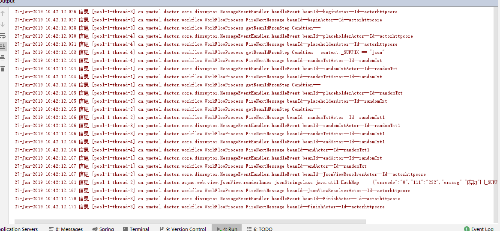

# **DActor**  
## Introduction
DActor框架可同时支持同步和异步代码，简化在线异步代码的开发，用同步代码的思维来开发异步代码，兼顾异步代码的高并发、无阻塞和同步代码的易读性，可维护性。
基于协程思想设计
最大程度的降低阻塞，提高单个线程的处理能力，并可有效的降低线程数。
## Overview
目前开发过程中的几个常见模型
 -  同步编程
    所有步骤都在一个主线程中完成,调用一个方法，等待其响应返回。一个请求占用一个线程,在有数据库操作、TCP和Http通讯时因为有阻塞情况，会导致占用线程占用而无法及时释放  
    ，因此在同步交易中引入了线程池概念,提高系统的吞吐量
 -  异步编程
    所有步骤都可在不同线程中完成,调用一个方法，不等待响应既返回，典型交易如NodeJs。
    目前市面上的异步框架都比较复杂，市面的通用解决方案是CallBack和Promise/Deferred模式模式。  
## 设计思路  
- 为了保留异步的高性能,简化异步的开发模式，同时使得程序更容易被程序员理解，在性能和代码可阅读性中间取得平衡，设计了此框架。    
- 处理步骤:将请求封装为消息,丢入消息队列，寻找合适步骤处理消息,上述过程不断循环，直到所有可用步骤都执行完毕。  
  因为是对消息队列进行处理,对于同步交易，处理完毕即可丢入消息队列。对于异步交易，等待回调完毕再丢入消息队列。  
  两种情况对于框架来说是无差别的。同时因为通过异步交易避免了阻塞情况的发生,所以可在不大幅度提高线程数的情况下，提高吞吐量，  
  同时也可在一定程度避免流量突增的情况发生。  
- 消息队列采用Disruptor的的高性能队列RingBuffer。
- 以Actor协程并发模型为基础设计框架。 
## Features
- 1、集成Netty
- 2、集成HttpClient
- 3、集成HttpServlet
- 4、支持多层父子结构
- 5、支持责任链模式  
- 6、J2EE支持json,csv,pdf,xml,html格式输出
- 7、J2EE支持数据流输出,动态文件下载、动态图片输出、跳转和可根据配置动态输出
 环境要求  
  JDK 1.8  
  Spring FrameWork 4.3.22.RELEASE +  
  Servlet 3.0+(因为需要使用Servlet的异步功能)  
 注意事项  
  请求的完整逻辑是分散在不同的线程中执行的，所以尽量避免使用ThreadLocal
## Release Note
 1.0.2版本
- 初始化版本
## Getting Started
  example是J2EE程序,下载后，可直接运行,其中集成了若干例子  
    默认使用.do提交相关交易，但如果是.json将会返回json数据
   启动后,在浏览器中输入http://localhost:8080/example/randomTxt2.json  
   输出的是json格式的字符串  
   randomTxt2:只有一级父子关系  
   randomTxt1:有二级父子关系 
   chaintest1:只使用责任链  
   chaintest2:同时使用责任链和一级父子关系  
   exceptionTest:子交易抛出错误,框架对错误的处理  
   httptest演示的是通过httpclient异步方式访问百度网站   
        访问URL:http://localhost:8080/example/ httptest.do  
   启动后，可在控制台看到内部调用结果  
   
   

### Maven dependency

```xml
<dependency>
    <groupId>cn.ymotel</groupId>
    <artifactId>dactor</artifactId>
    <version>1.0.2</version>
</dependency>
```
### Gradle dependency

```
compile group: 'cn.ymotel', name: 'dactor', version:'1.0.2'

```

### 代码简单讲解
执行过程为chain->grandfather->parent->Selft。
依次调用执行责任链中逻辑，grandfather中的逻辑，parent的逻辑和自身逻辑。
chain,grandfather,parent都可为空，不设置
在grandfather和parent中的Steps中至少有一个为placeholderActor交易，以调用子逻辑

整个过程中，需要先设置全局占位符  
    <actor:global id="actorglobal">  
           <actor:param name="beginBeanId" value="beginActor"/>  
           <actor:param name="endBeanId" value="endActor"/>  
       </actor:global>  
交易中如果未填写beginBeanId或者endBeanId时，系统默认使用全局中配置的beginBeanId或者endBeanId  
```
   <actor id="randomTxt" parent="actorhttpcore" beginBeanId="randomTxtActor">
        <steps>
            <step fromBeanId="randomTxtActor" toBeanId="placeholderActor" conditon=""/>
            <step fromBeanId="placeholderActor" toBeanId="endActor" conditon=""/>
        </steps>
    </actor>
 ```
condtion可为空，空字符串，或者是ognl表达式  
placeholderActor的作用是在暂存当前环境，并调用子交易，待子交易执行完毕后，再恢复当前环境继续执行  
如果在Step中未找到toBeanIdActor，会直接调用endBeanId方法，认为自身交易已执行结束。  
交易的请求和流转信息都保存在Message中  
如果指定handleException=false或者使用默认设置，直接返回父中执行，如果父中也未捕获，则继续返回上一级执行，    
一般来说至少有要有一个actor中指定handleException=true
<bean id="MessageRingBufferDispatcher" class="cn.ymotel.dactor.core.disruptor.MessageRingBufferDispatcher">
</bean>
启动框架接收和执行请求
